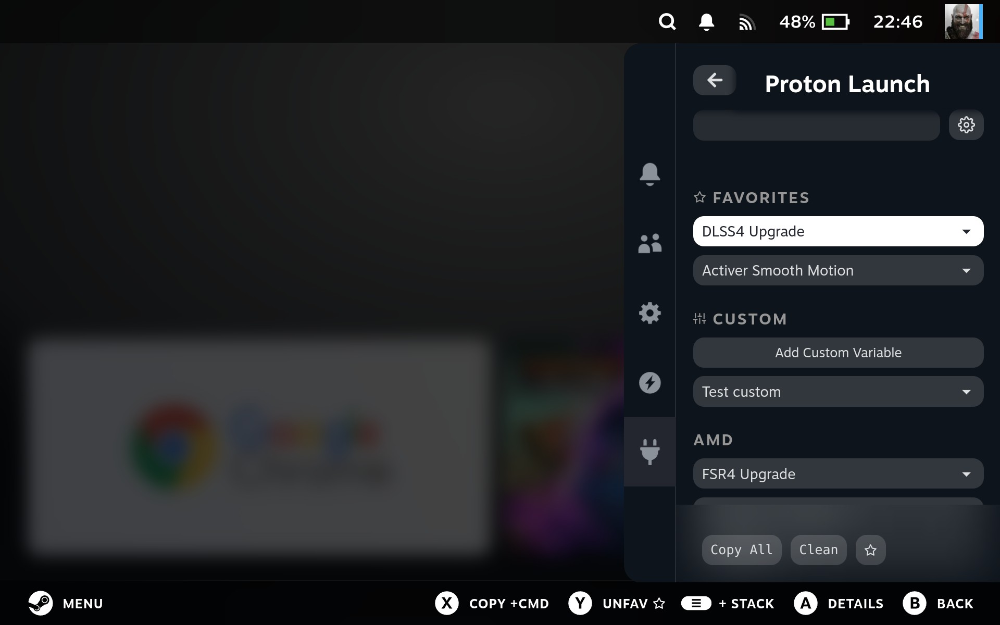
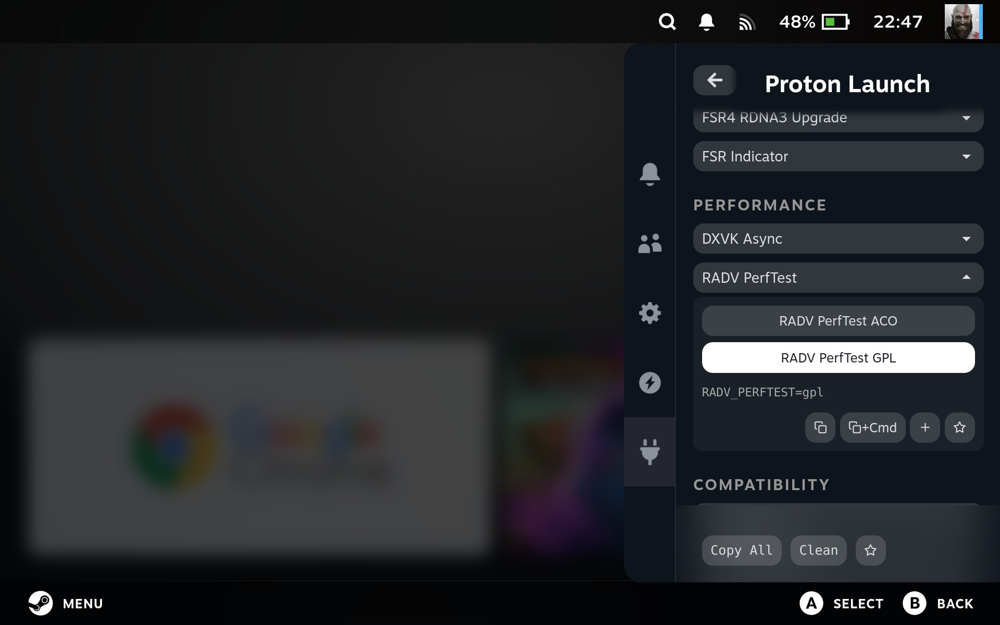
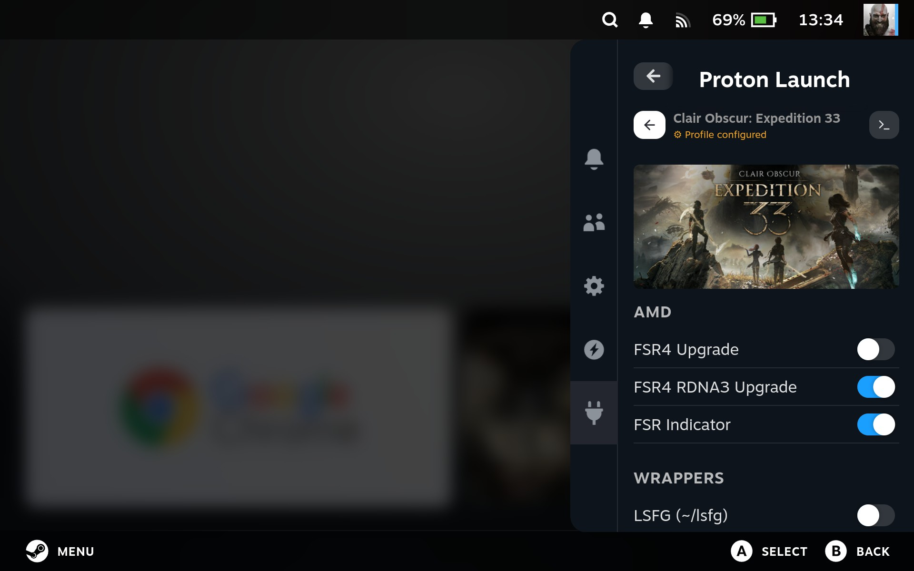
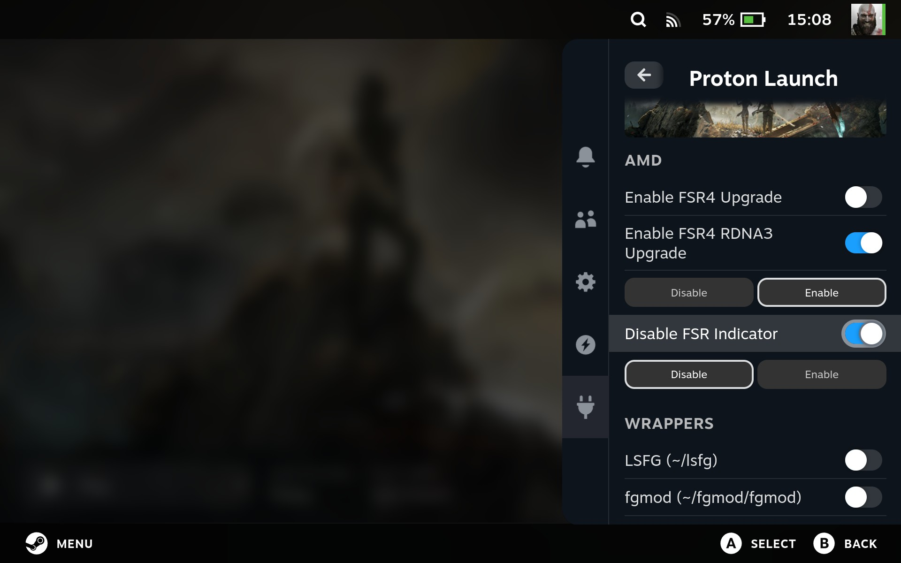
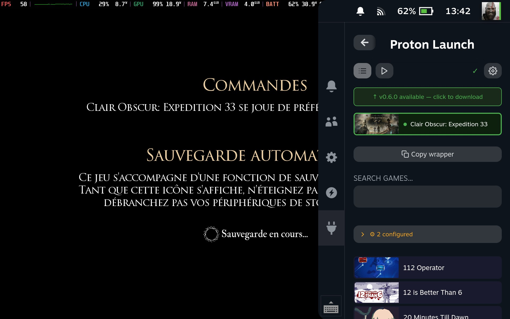
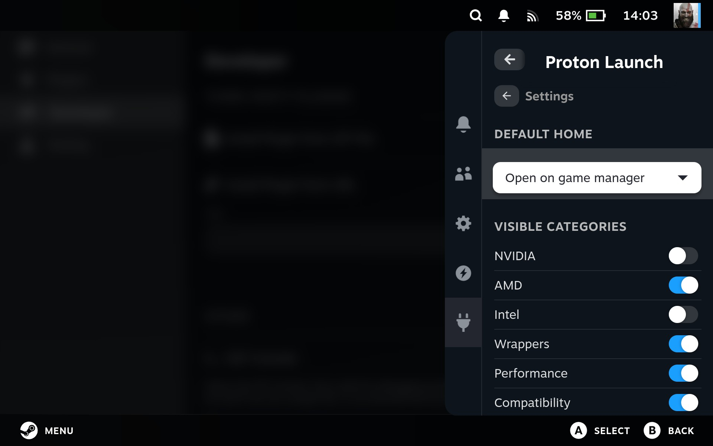
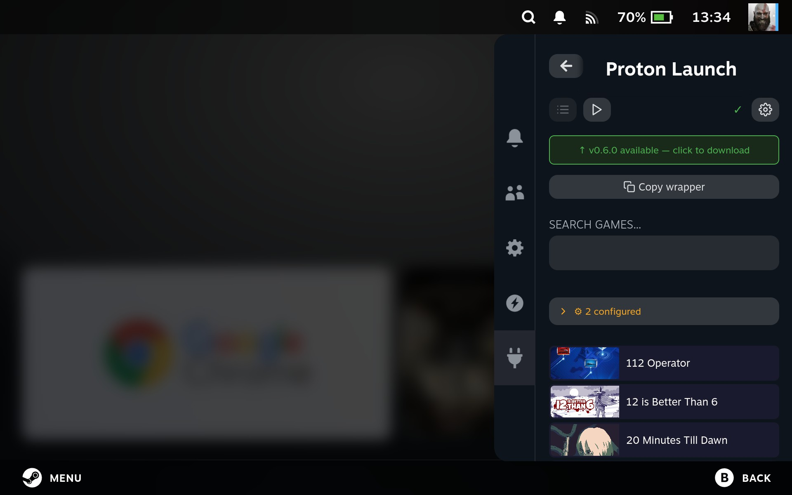

# decky-proton-launch


**Manage Proton launch options easily on your Steam Deck via Decky Loader.**

Decky Proton Launch provides a simple, intuitive interface to enable commonly used Proton environment variables for your Steam games. Select one or multiple options, copy the wrapper command, or configure per-game profiles directly from the plugin.

---

## Screenshots

### Variable list & selection




### Per-game configuration

Click on any game to open its profile and configure launch options individually. Changes apply on next game launch.



When an option is enabled, you can instantly switch its value between **Enable** and **Disable** directly from the game profile.



### Running game detection

The plugin automatically detects the currently running game and shows it at the top — click it to jump directly to its settings.



### Global commands

Set commands once from the globe icon in the top bar and they apply to every game that has the wrapper installed — no need to configure each game individually. Open any game's page to disable a specific globally-enabled command just for that game, without touching the global setting.

### Settings

The settings view lets you choose the default home tab (variable list, game manager, or global commands) and toggle the visibility of each variable category to keep only what's relevant to you.



### Update notifications

When a new version is available, a banner appears at the top with a direct link to download it.



---

## Features

- **Predefined Proton variables**: FSR4, DLSS4, XeSS, DXVK Async, ESYNC/FSYNC, MangoHud, and more
- **Global commands**: enable commands once for every game with the wrapper, with per-game override to disable one individually
- **Per-game profiles**: configure and save launch options per game
- **Favorites with full controls**: pinned commands keep their enable/disable toggle and enum value picker, right at the top
- **Running game detection**: instantly jump to the settings of the game you're playing
- **Wrapper script**: copy the `~/proton-launch %command%` wrapper or install it with one click
- **Category visibility**: show or hide variable categories from the settings view
- **Update notifications**: banner shown when a newer version is available on GitHub
- **Gamepad navigation**: fully accessible with the Steam Deck controller
- **Multi-language support**: EN, FR, DE, ES, IT, PT-BR, PT-PT, RU, PL, NL, TR, UK, JA, KO, ZH-CN

---

## Installation

Download the latest release zip from the [Releases page](https://github.com/moi952/decky-proton-launch/releases/latest) and load it via Decky Loader, or build from source:

1. Clone the repository:

```bash
git clone https://github.com/moi952/decky-proton-launch.git
```

2. Install dependencies:

```bash
sudo npm install -g pnpm@9
pnpm install
```

3. Build the plugin:

```bash
pnpm run build
```

4. Load the plugin via Decky Loader.

---

## Contributing

Contributions are welcome!

- **New language**: add a JSON file in `src/i18n/locales/` following the existing structure and open a PR.
- **New Proton variable**: propose it via an issue or a PR, following the category and naming conventions in `src/data/variables.json`.

---

## License

BSD-3-Clause License
