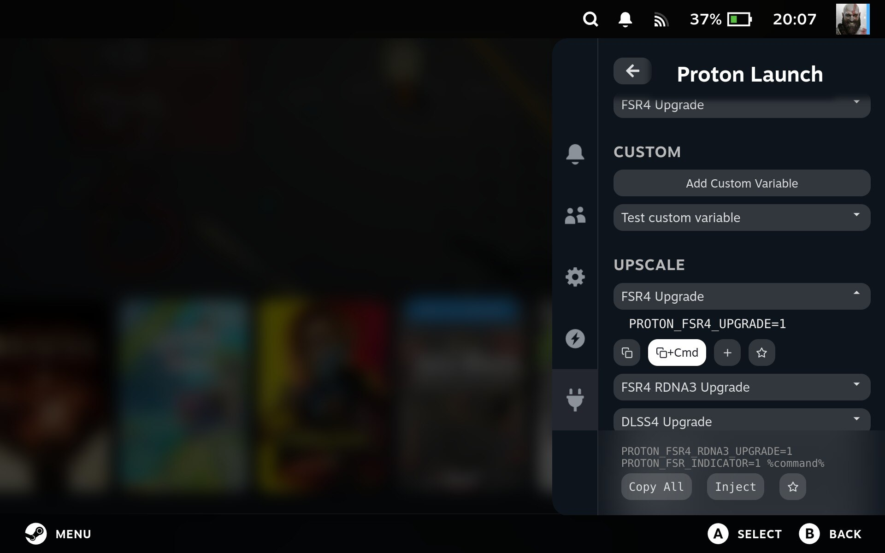

# decky-proton-launch

**Manage Proton launch options easily on your Steam Deck via Decky Loader.**

Decky Proton Launch provides a simple, intuitive interface to enable commonly used Proton environment variables for your Steam games. Select one or multiple options, copy them, or inject directly into the game's launch parameters.



---

## Features

- **Predefined Proton variables**: FSR4, DLSS4, XeSS, DXVK Async, ESYNC/FSYNC, MangoHud, and more
- **Multi-selection support**: select several options and copy them together
- **Copy options**: copy only the environment variable, or variable + `%command%` for launch
- **Inject directly**: append selected variables to game launch options
- **Collapsible categories**: Upscale, Performance, Compatibility, Debug
- **Command visibility on demand**: commands hidden by default; expand by clicking the title
- **Multi-language support**: EN, FR, ES, PT, DE, RU, JA, and more
- **Decky UI compliant**: responsive, mobile-friendly, buttons under title for quick access

---

## Installation

1. Clone or download the repository:

git clone https://github.com/YOUR_USERNAME/decky-proton-launch.git

2. Build the plugin:

Install pnpm if necessary

```bash
sudo npm install -g pnpm@9
```

Install dependencies

```bash
pnpm install
```

Compile the plugin

```bash
pnpm run build
```

3. Load the plugin with Decky Loader.

## Contributing

We welcome contributions!

Adding a new language: If you want to add translations for another language, feel free to open an issue or submit a PR with your JSON file.

Adding a new Proton variable: If you have a useful variable to include, you can propose it via an issue or a PR.

Please follow the existing structure for categories and naming.

## License

MIT License
