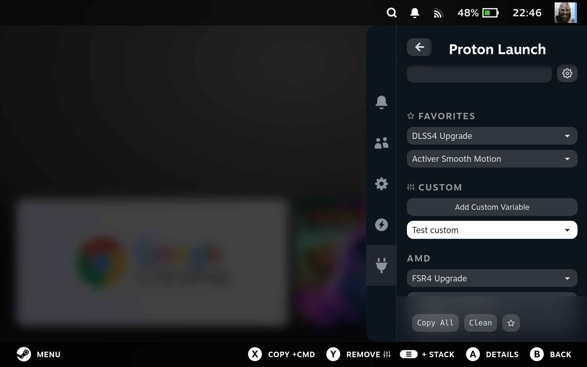
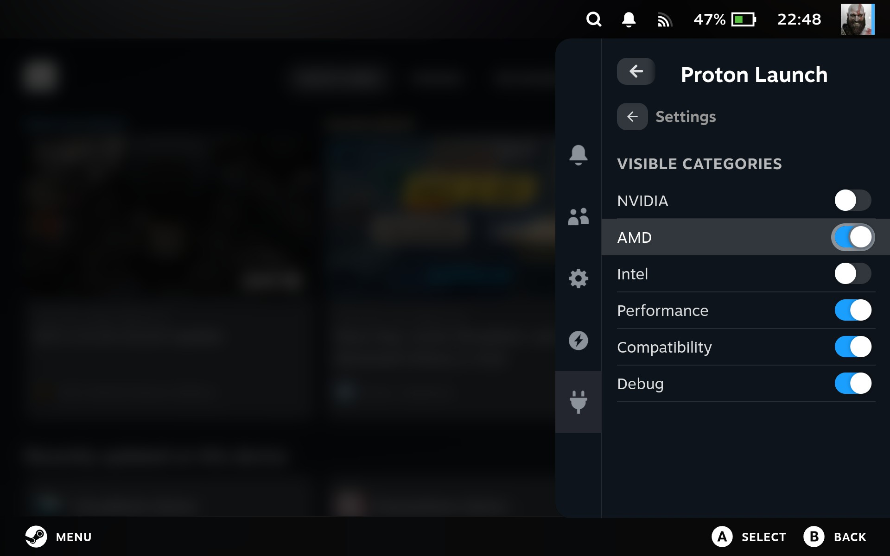

# decky-proton-launch

**Manage Proton launch options easily on your Steam Deck via Decky Loader.**

Decky Proton Launch provides a simple, intuitive interface to enable commonly used Proton environment variables for your Steam games. Select one or multiple options, copy them, or inject directly into the game's launch parameters.






---

## Features

- **Predefined Proton variables**: FSR4, DLSS4, XeSS, DXVK Async, ESYNC/FSYNC, MangoHud, and more
- **Multi-selection support**: select several options and combine them into a single launch string
- **Copy options**: copy the variable only, or variable + `%command%` ready to paste
- **Inject directly**: append selected variables to a game's launch options in one click
- **Favorites**: save your most-used combinations for quick access
- **Custom variables**: create your own environment variables with a name, key and value
- **Category visibility**: show or hide categories from the settings view
- **Gamepad navigation**: fully accessible with the Steam Deck controller
- **Multi-language support**: EN, FR, DE, ES, IT, PT-BR, PT-PT, RU, PL, NL, TR, UK, JA, KO, ZH-CN

---

## Installation

1. Clone the repository:

```bash
git clone https://github.com/YOUR_USERNAME/decky-proton-launch.git
```

2. Install dependencies:

```bash
sudo npm install -g pnpm@9
pnpm install
```

3. Build the plugin:

```bash
pnpm run build
```

4. Load the plugin via Decky Loader.

---

## Contributing

Contributions are welcome!

- **New language**: add a JSON file in `src/locales/` following the existing structure and open a PR.
- **New Proton variable**: propose it via an issue or a PR, following the category and naming conventions in `src/data/variables.json`.

---

## License

MIT License
