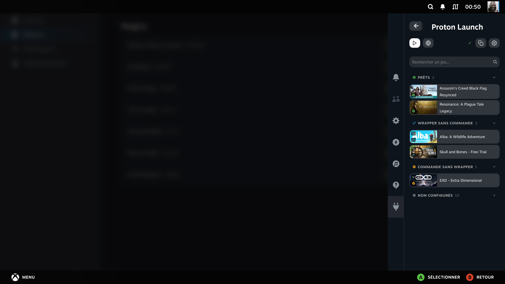
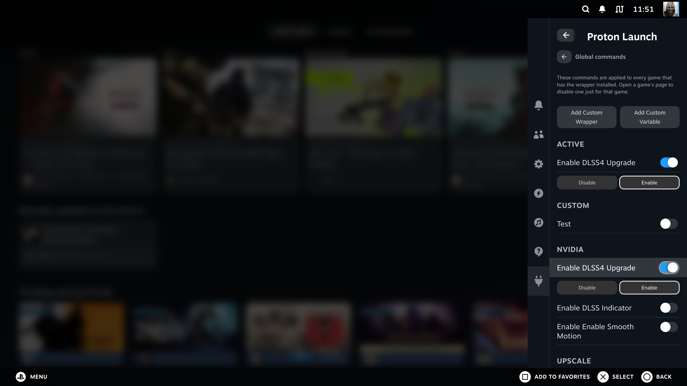
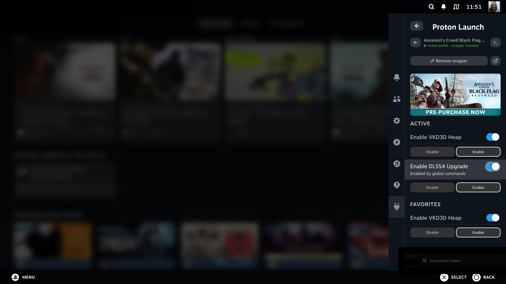
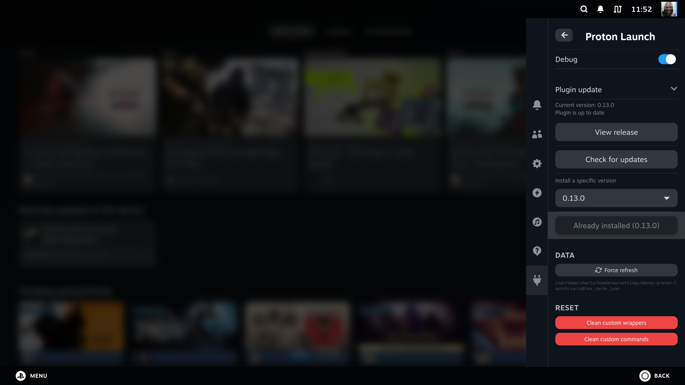
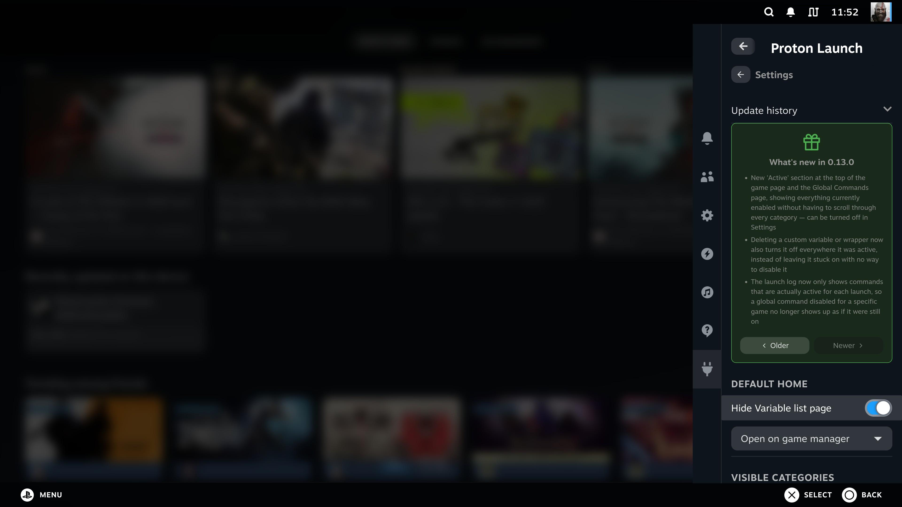

# decky-proton-launch


**Manage Proton launch options easily on your Steam Deck via Decky Loader.**

Decky Proton Launch provides a simple, intuitive interface to enable commonly used Proton environment variables for your Steam games. Select one or multiple options, copy the wrapper command, or configure per-game profiles directly from the plugin.

### ✨ New in 0.15.0

- New games list page: reorganized into 4 collapsible groups — Ready, Wrapper only, Commands only, Not configured — the first 3 remember their state between visits, the last one always starts collapsed
- Removing a wrapper from the games list now confirms inline, matching the game detail page, instead of opening a popup
- The games list search bar now shows a placeholder and a search icon
- The game list no longer shows Proton or the Steam Linux Runtime
- VKD3D_CONFIG is now sorted alphabetically, with an "X enabled" counter and a toggle (Y button, shown in the bottom bar) between raw and formatted names
- Each selected VKD3D_CONFIG value now shows on its own line instead of being comma-separated
- VKD3D_CONFIG and DXVK_ASYNC are now grouped under their own "DXVK" sub-category
- New variables: DXVK_CONFIG (checklist with per-option values), VKD3D_FRAME_RATE (free-text field), and VKD3D_SWAPCHAIN_PRESENT_MODE
- A custom variable can now reuse a catalog entry's environment variable instead of being blocked
- Fixed a bug that could keep stale variable data cached after an update
- Fixed a bug where deactivating a game's last command could silently remove its wrapper, even while global commands were still active
- Fixed a bug where modifying a game's commands could silently re-add a wrapper that had just been removed

---

## Screenshots

### Games list

Your Steam library, grouped by configuration status — Ready, Wrapper only, Commands only, Not configured — with a search bar to quickly find a game.



### Per-game configuration

Click on any game to open its profile and configure launch options individually. Changes apply on next game launch.


When an option is enabled, you can instantly switch its value between **Enable** and **Disable** directly from the game profile.


### Global commands

Set commands once from the globe icon in the top bar and they apply to every game that has the wrapper installed — no need to configure each game individually. Add your own custom variables or wrappers directly from this page.



Open any game's page to disable a specific globally-enabled command just for that game, without touching the global setting. The **Active** section at the top always shows everything currently enabled, including which ones come from global commands, without having to scroll through every category.



### Running game detection

The plugin automatically detects the currently running game and shows it at the top — click it to jump directly to its settings.


### Settings

The settings view lets you choose the default home tab (variable list, game manager, or global commands) and toggle the visibility of each variable category to keep only what's relevant to you.


You can also check for plugin updates, install any past release from a version picker, force-refresh the variable data, or reset your custom wrappers/commands from here.



### Update notifications

When a new version is available, a banner appears at the top with a direct link to download it. Past updates are also viewable at any time from the update history section.




### Variable list & selection


---

## Features

- **Predefined Proton variables**: FSR4, DLSS4, XeSS, DXVK Async, ESYNC/FSYNC, MangoHud, and more
- **Global commands**: enable commands once for every game with the wrapper, with per-game override to disable one individually
- **Per-game profiles**: configure and save launch options per game
- **Favorites with full controls**: pinned commands keep their enable/disable toggle and enum value picker, right at the top
- **Running game detection**: instantly jump to the settings of the game you're playing
- **Wrapper script**: copy the `~/proton-launch %command%` wrapper or install it with one click
- **Category visibility**: show or hide variable categories from the settings view
- **Update notifications**: banner shown when a newer version is available on GitHub
- **Gamepad navigation**: fully accessible with the Steam Deck controller
- **Multi-language support**: EN, FR, DE, ES, IT, PT-BR, PT-PT, RU, PL, NL, TR, UK, JA, KO, ZH-CN

---

## Installation

Download the latest release zip from the [Releases page](https://github.com/moi952/decky-proton-launch/releases/latest) and load it via Decky Loader, or build from source:

1. Clone the repository:

```bash
git clone https://github.com/moi952/decky-proton-launch.git
```

2. Install dependencies:

```bash
sudo npm install -g pnpm@9
pnpm install
```

3. Build the plugin:

```bash
pnpm run build
```

4. Load the plugin via Decky Loader.

---

## Contributing

Contributions are welcome!

- **New language**: add a JSON file in `src/i18n/locales/` following the existing structure and open a PR.
- **New Proton variable**: propose it via an issue or a PR, following the category and naming conventions in `src/data/variables.json`.

---

## License

BSD-3-Clause License
